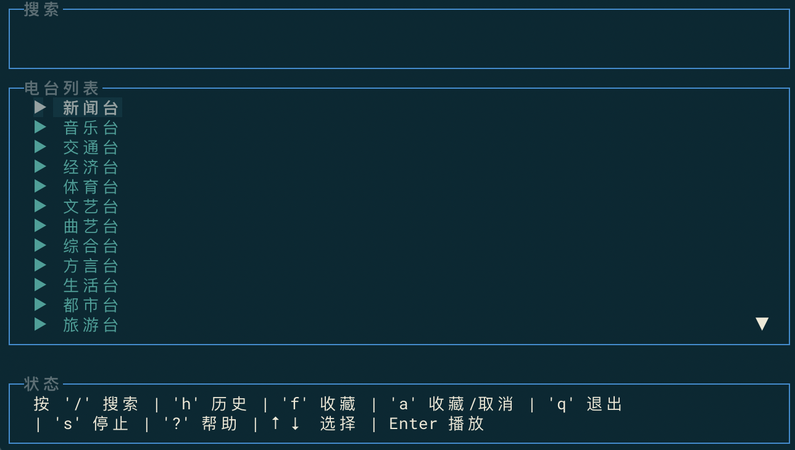

# FMgo

FMgo 是一个基于终端的 macOS 广播电台客户端，使用 Go 语言开发。它提供了简洁的终端用户界面，让您可以方便地收听各类广播电台。

## 功能特点

- 🔍 智能搜索：快速查找您喜欢的电台
- 📻 实时播放：流畅的电台直播流播放
- 📋 分类浏览：支持多种电台分类（新闻台、音乐台、交通台等）
- 📝 播放历史：记录您最近收听的电台
- ⭐ 收藏功能：收藏您喜爱的电台
- 💻 终端界面：简洁优雅的 TUI 设计

## 使用指南
[下载最新版本](https://github.com/rpnanhai/FMgo/releases)
- `chomd +x FMgo`
- `./FMgo` 可选参数
  - `-config string`
  外部电台配置文件路径(可选)
  - `-version`
  显示版本信息

### 基础操作
- `↑/↓`: 选择电台
- `Enter`: 播放选中电台
- `q`: 退出程序

### 功能快捷键
- `/`: 搜索
- `h`: 播放历史
- `f`: 收藏列表
- `a`: 收藏/取消收藏
- `s`: 停止
- `?`: 显示帮助信息

## 依赖

- github.com/gizak/termui：终端UI框架
- github.com/mattn/go-sqlite3：数据存储

## 注意事项

- 目前仅支持 macOS 平台
- 需要稳定的网络连接
- 建议使用较新版本的终端模拟器
- 目前广播源来自喜马拉雅，可以通过修改 `radio.json` 文件来替换其他音频直播流

## 致谢

- [GoLand](https://www.jetbrains.com/go/): 强大的Go语言IDE，为本项目的开发提供了极大便利
- [Windsurf](https://www.codeium.com/windsurf): 智能的AI编程助手，完成大部分代码编写优化，改进代码质量

## 开源协议

本项目采用 [MIT](LICENSE) 开源协议。

## 反馈与建议

如果您在使用过程中遇到问题或有任何建议，欢迎提出 issue。
